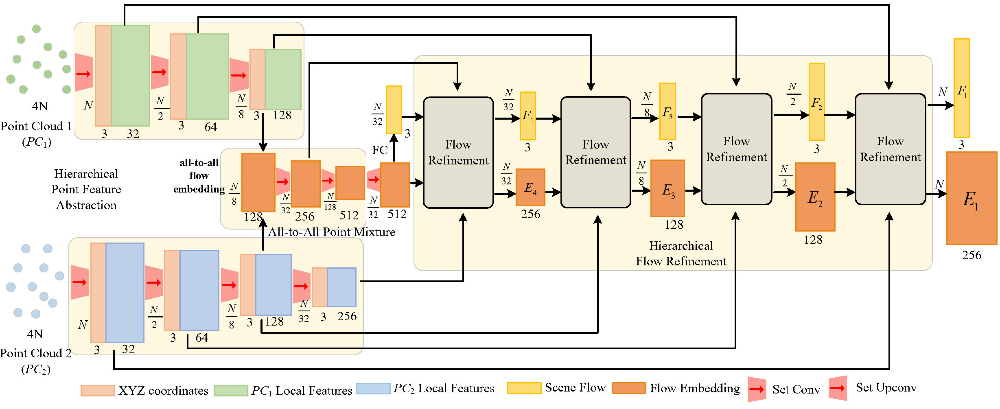
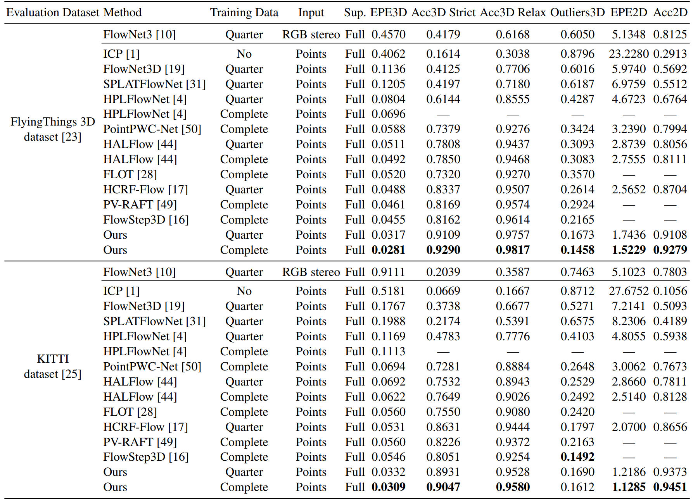
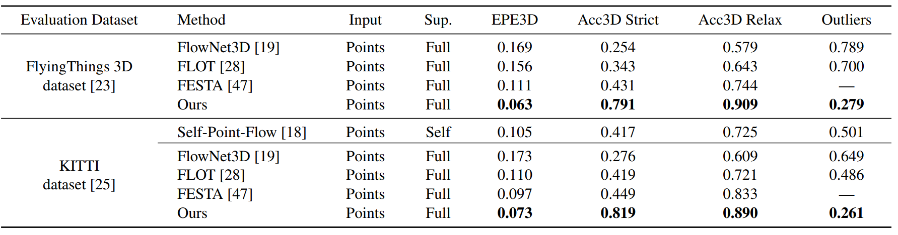

# **What Matters for 3D Scene Flow Network** (ECCV2022)

This is the official implementation of our ECCV 2022 paper:

 "What Matters for 3D Scene Flow Network"

Guangming Wang, Yunzhe Hu, Zhe Liu, Yiyang Zhou, Masayoshi Tomizuka, Wei Zhan, and Hesheng Wang




## Prerequisites

+ Python 3.6.9
+ PyTorch 1.8.0
+ CUDA 11.1
+ numba
+ tqdm

## Data preprocessing

**Data without occlusion**

For fair comparison with previous methods, we adopt the preprocessing steps in [HPLFlowNet](https://web.cs.ucdavis.edu/~yjlee/projects/cvpr2019-HPLFlowNet.pdf). Please refer to [repo](https://github.com/laoreja/HPLFlowNet). We also copy the preprocessing instructions here for your reference.

* FlyingThings3D:
Download and unzip the "Disparity", "Disparity Occlusions", "Disparity change", "Optical flow", "Flow Occlusions" for DispNet/FlowNet2.0 dataset subsets from the [FlyingThings3D website](https://lmb.informatik.uni-freiburg.de/resources/datasets/SceneFlowDatasets.en.html) (we used the paths from [this file](https://lmb.informatik.uni-freiburg.de/data/FlyingThings3D_subset/FlyingThings3D_subset_all_download_paths.txt), now they added torrent downloads)
. They will be upzipped into the same directory, `RAW_DATA_PATH`. Then run the following script for 3D reconstruction:

```bash
python3 data_preprocess/process_flyingthings3d_subset.py --raw_data_path RAW_DATA_PATH --save_path SAVE_PATH/FlyingThings3D_subset_processed_35m --only_save_near_pts
```

* KITTI Scene Flow 2015
Download and unzip [KITTI Scene Flow Evaluation 2015](http://www.cvlibs.net/download.php?file=data_scene_flow.zip) to directory `RAW_DATA_PATH`.
Run the following script for 3D reconstruction:

```bash
python3 data_preprocess/process_kitti.py RAW_DATA_PATH SAVE_PATH/KITTI_processed_occ_final
```

**Data with occlusion**

The data with occlusion is prepared by [FlowNet3D](https://openaccess.thecvf.com/content_CVPR_2019/papers/Liu_FlowNet3D_Learning_Scene_Flow_in_3D_Point_Clouds_CVPR_2019_paper.pdf). Please refer to their [repo](https://github.com/xingyul/flownet3d). You can directly download their prepared data from [here](https://drive.google.com/file/d/1CMaxdt-Tg1Wct8v8eGNwuT7qRSIyJPY-/view) and [here](https://drive.google.com/file/d/1XBsF35wKY0rmaL7x7grD_evvKCAccbKi/view), then unzip to `SAVE_PATH`.

## Usage

**Install pointnet2 library**

Compile the furthest point sampling, grouping and gathering operation for PyTorch. We use operations from this [repo](https://github.com/sshaoshuai/Pointnet2.PyTorch).

```
cd pointnet2
python setup.py install
cd ../
```

**Train on non-occluded data**

Set `data_root` in `config_train.yaml`  to `SAVE_PATH` in the data preprocess section. Then run
```bash
python train.py config_train.yaml
```
After training the model with a quarter dataset, you can finetune the model with the full dataset and achieve a better results by running the following command. Remember to set `pretrain` in `config_train_finetune.yaml` as the path to the pretrained weights. 
```bash
python train.py config_train_finetune.yaml
```

**Evaluate on non-occluded data**

We provide pretrained weights in ```pretrain_weights``` (**EPE3D: 0.0282**).

Set `data_root` and in `config_evaluate.yaml` to `SAVE_PATH` in the data preprocess section, and specify `dataset` in the script . Then run
```bash
python evaluate.py config_evaluate.yaml
```

**Train on occluded data**

Similarly, specify `data_root` in `config_train_occlusion.yaml`. Then run 

```
python train_occlusion.py config_train_occlusion.yaml
```

**Evaluate on occluded data**

We provide pretrained weights in ```pretrain_weights``` (**EPE3D: 0.0636**).

Specify `data_root` and `dataset` in `config_evaluate_occlusion.yaml`. Then run 

```
python evaluate_occlusion.py config_evaluate_occlusion.yaml
```

## Quantitative results

**On non-occluded data**



**On occluded data**


## Citation

If you find our work useful in your research, please cite:

```
@inproceedings{wang2022ThreeDFlow,
  title={What Matters for 3D Scene Flow Network},
  author={Wang, Guangming and Hu, Yunzhe and Liu, Zhe and Zhou, Yiyang and Tomizuka, Masayoshi and Zhan, Wei and Wang, Hesheng},
  booktitle={European Conference on Computer Vision},
  year={2022},
  organization={Springer}
}
```

## Acknowledgements

We thank the following open-source projects for the help of the implementations.

+ [PointNet++](https://github.com/charlesq34/pointnet2) 

+ [HALFlow](https://github.com/IRMVLab/HALFlow)

+ [PointPWC-Net](https://github.com/DylanWusee/PointPWC)
